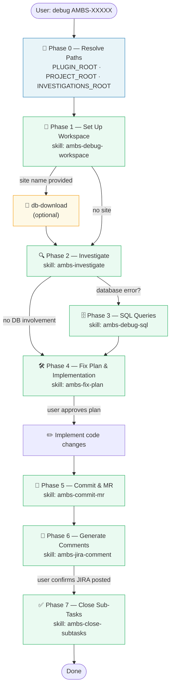
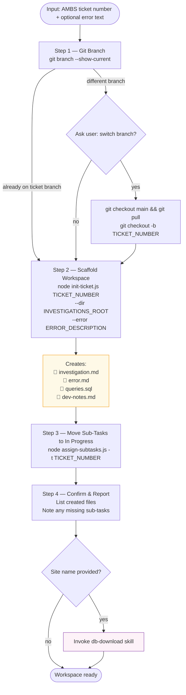
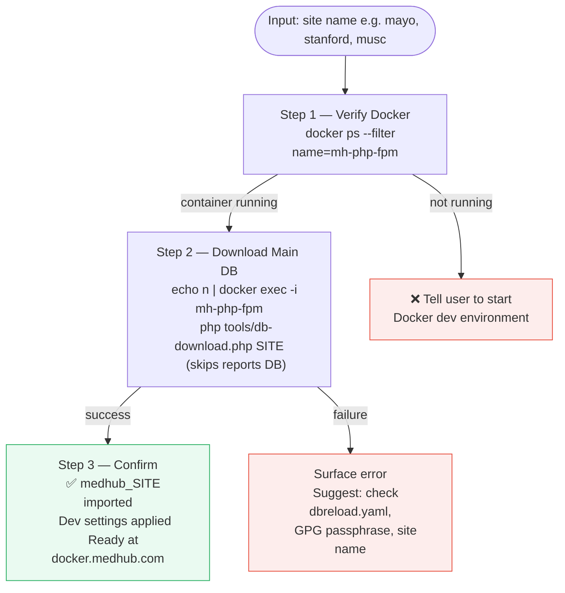
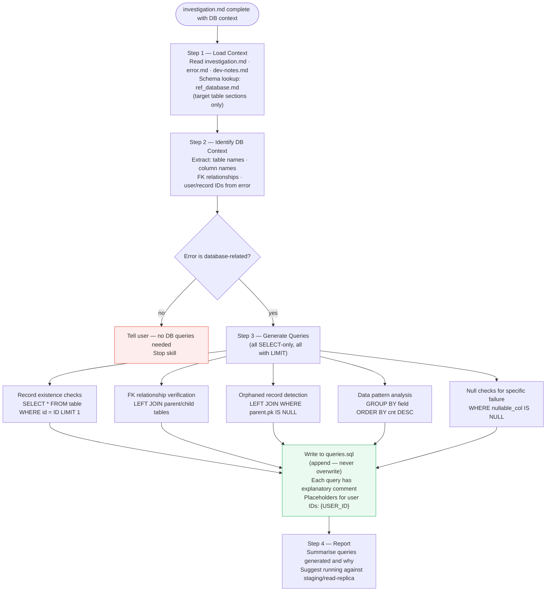
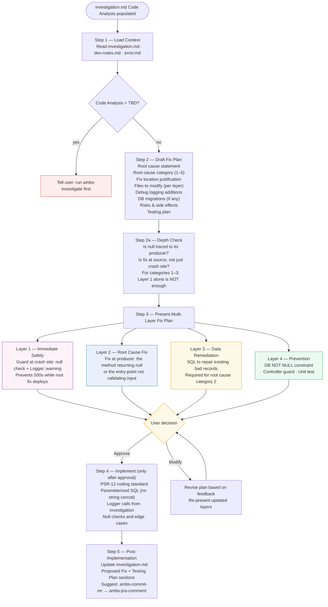
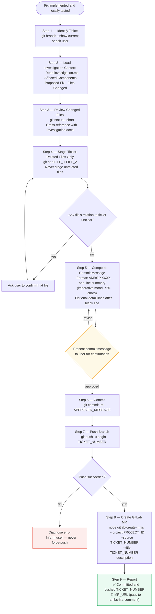
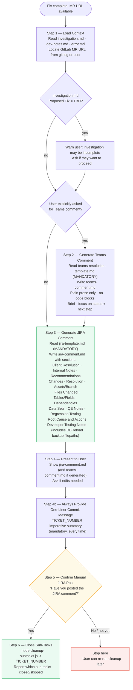
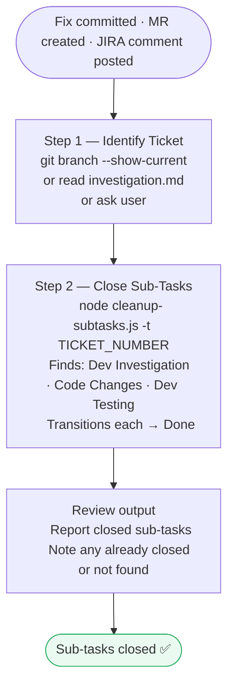

# ambs-debug Agent — Mermaid Diagrams

## Overview: Agent Phases & Skills

---

## Phase 1 — `ambs-debug-workspace`

---

## Phase 1 (optional) — `db-download`

---

## Phase 2 — `ambs-investigate`

```mermaid
flowchart TD
    IN([Workspace exists with error.md]) --> S1

    S1["Step 1 — Load Context
    Read error.md · investigation.md · dev-notes.md"]

    S1 --> S2["Step 2 — Parse the Error
    Extract: stack trace, file paths, line numbers
    class names, DB errors, user context
    → Update Error Summary in investigation.md"]

    S2 --> S2A["Step 2a — Business Context
    What does this feature do?
    Who uses it? Where does error occur in workflow?
    → Write Feature Overview section"]

    S2A --> S3["Step 3 — Build Doc Brief"]

    S3 --> S3A["3a — Extract lookup keys
    PHP classes · table names · feature keyword"]

    S3A --> S3B["3b — Confluence lookup
    1. Check TAGS.json
    2. Scan index.json titles/summaries
    3. Load up to 5 matching pages"]

    S3B --> S3C["3c — Project docs
    ref_database.md (table sections only)
    system-architecture.md (if unfamiliar module)
    docs/features/FEATURE.md (create stub if missing)"]

    S3C --> S3D["3d — Write Doc Brief
    Populate Related Documentation section
    Note ⚠️ stale pages > 30 days"]

    S3D --> S3E["3e — Update TAGS.json
    Add new class/table/feature → page ID mappings"]

    S3E --> S4["Step 4 — Search Codebase
    Exact file + line from stack trace
    Controllers · Models · Services · DB queries
    Similar patterns & existing fixes"]

    S4 --> S4BT["Backward trace (null/unexpected-value errors)
    Where was the null value produced?
    Is fix at crash site or producer?"]

    S4BT --> S4FT["Forward trace (request-input errors)
    Find callers of the endpoint
    Is the bad value reachable via normal user flow?"]

    S4FT --> S4A["Step 4a — Search Past Investigations
    grep INVESTIGATIONS_ROOT for class/table names
    Read related investigation.md files"]

    S4A --> S4B["Step 4b — Core Domain Patterns
    Identify Model::get() · getOrNew() · getOrFail()
    Bug usually in CALLER, not the method"]

    S4B --> S4C{Class/file found in PROJECT_ROOT?}
    S4C -->|no| S4D["Step 4c — Search Sibling Projects
    support/ · app-server/ · global-api/ · framework/
    Update PROJECT_ROOT to owning repo"]
    S4C -->|yes| S4E
    S4D --> S4E

    S4E["Step 4d — Git History
    git log --follow failing file
    Find introducing commit & ticket"]

    S4E --> S5["Step 5 — Root Cause Hypothesis
    Classify category 1–5
    Record in Root Cause Depth block"]

    S5 --> S6["Step 6 — Reproduction Steps
    Local docker.medhub.com steps
    Verified against actual caller traces"]

    S6 --> DONE["Update investigation.md
    All sections populated including
    Affected Components, Code Analysis,
    Proposed Fix (initial), Debug Logging"]

    style S3B fill:#fef9e7,stroke:#f39c12
    style S4BT fill:#fdf2f8,stroke:#8e44ad
    style S4FT fill:#fdf2f8,stroke:#8e44ad
    style DONE fill:#eafaf1,stroke:#27ae60
```

---

## Phase 3 — `ambs-debug-sql`

---

## Phase 4 — `ambs-fix-plan`

---

## Phase 5 — `ambs-commit-mr`

---

## Phase 6 — `ambs-jira-comment`

---

## Phase 7 — `ambs-close-subtasks`

